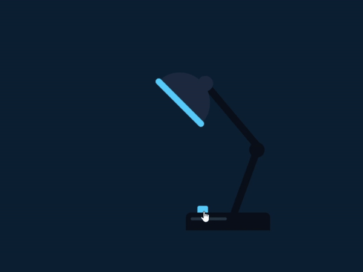

# 💡 Interactive Neon Desk Lamp – CSS Animation

A small front-end project that recreates an interactive desk lamp using **pure HTML & CSS**.  
The lamp can be turned ON and OFF using a custom switch, and the animation simulates a neon-style light beam.

---

## 🚀 Live Demo
The project is available here: 

👉 https://matiscalella.github.io/css-on-off-lamp/

---

## 🎯 Project Overview

This mini-project focuses on:
- Creating shapes using only CSS (no images)
- Building an interactive switch using a `<input type="checkbox">`
- Simulating a light beam with CSS borders and transparency
- Adding neon glow effects with `drop-shadow()` and RGBA values
- Practicing clean layout using absolute positioning

The goal was to design a small but visually appealing component that demonstrates animation, interaction, and styling skills.

---

## 🎨 Color Palette (Blue Ice Variant)

| Purpose | Color |
|--------|--------|
| Background | `#0b1f33` |
| Lamp Structure | `#0a0f1a` |
| Bulb (Off) | `#1c2b40` |
| Neon Light | `#4dc4ff` |
| Soft Glow | `#94e2ff` |
| Light Beam | `rgba(77, 196, 255, 0.45)` |

---

## 🧱 Technologies Used

- **HTML5**
- **CSS3**
- Custom CSS animations
- `drop-shadow()` and RGBA transparency
- Pure CSS geometry (no SVGs, no JS)

---

## 📦 File Structure
/root
│── index.html
│── style.css
└── lamp_600px.gif (Demo animation)

---

## 📘 What I Learned

- How to simulate complex shapes using only `:before` and `:after`
- How to create a neon glow effect with shadows and transparency
- How to use a checkbox as an interactive switch
- How to position elements precisely using absolute layout
- How to export and optimize GIFs for use in a GitHub README

---

## 🚀 How to Run

Just open `index.html` in your browser.

No frameworks, libraries, or build tools required.

---

## 🔮 Future Improvements

- Add smooth transitions when toggling the lamp
- Add multiple color themes (neon green, magenta, etc.)
- Add a shadows-on-the-table effect when the lamp is ON
- Convert the project into a reusable web component

---

## 📄 License

This project is released under the MIT License.  
Feel free to use it, remix it, and build your own animations!

